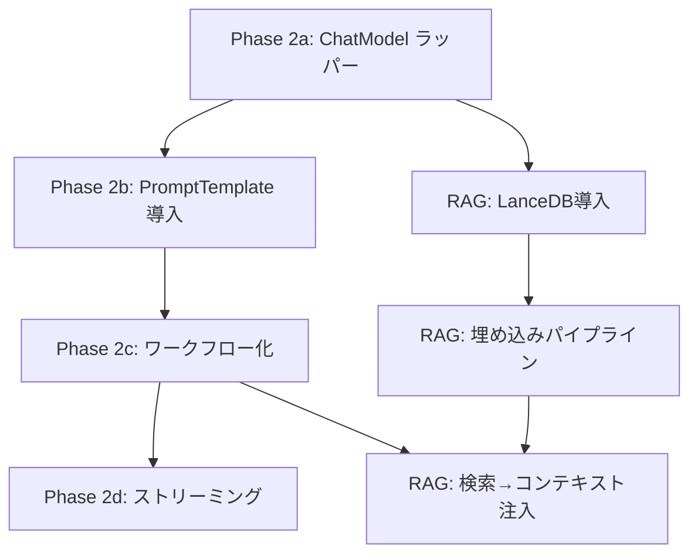

# Phase 2 実装計画書

## AI Team Builder（AIカンパニー）Phase 2 設計

**バージョン:** 0.2（見直し版）
**作成日:** 2026-07-20
**最終更新日:** 2026-07-20
**関連ドキュメント:** [DESIGN_SPEC.md](./DESIGN_SPEC.md) §9, [DATA_SCHEMA.md](./DATA_SCHEMA.md) §6

---

## 0. なぜPhase 2なのか（動機）

Phase 1 では「動作すること」を最優先に、以下のトレードオフを受け入れた：

- **LLM呼び出し**: 3プロバイダー（OpenAI/Anthropic/Gemini）のAPIを素の `fetch()` で直接叩いている（`MeetingScreen.tsx` の `runNextSpeaker()` ）
- **会議オーケストレーション**: `useEffect` + `setTimeout` の自前ループ（ラウンドロビン制御）
- **知識ベース**: 皆無。会議ログはSQLiteに蓄積するのみで、検索・参照はできない

Phase 2 ではこれらの「動くけど粗い」部分を、保守性・拡張性・品質の面で一段階引き上げる。

---

## 1. LangChain.js 導入計画

### 1.1 現状の課題

| 観点 | 現状（Phase 1） | 問題点 |
|---|---|---|
| LLM呼び出し | `fetch()` × 3プロバイダー（switch-case） | プロバイダー追加のたびにMeetingScreenの改修が必要 |
| プロンプト構築 | 文字列連結（`+` 演算子） | テンプレートの管理不能、文脈依存のテスト不可 |
| エラーハンドリング | 各APIのエラーレスポンスを個別にパース | 共通化されていない、リトライなし |
| トークン管理 | 自前で `prompt_tokens / completion_tokens` を集計 | LangChain側で標準提供される機能の再実装 |
| ストリーミング | 未対応（全レスポンス待ち） | UX改善の余地大 |

### 1.2 導入方針：段階的置き換え（Strangler Fig パターン）

現在の自前実装を一度に全置き換えするのはリスクが高い。以下の段階で徐々に差し替える：

```
Phase 2a: ChatModel ラッパーの導入（薄いインターフェース）
Phase 2b: プロンプトテンプレートの標準化
Phase 2c: チェーン/ワークフローの導入
Phase 2d: ストリーミング対応 + エージェント化
```

#### Phase 2a: ChatModel ラッパー（最優先）

現在の `fetch()` 呼び出しを、LangChain.js の `@langchain/core` にある `ChatModel` インターフェースでラップする。

**変更内容:**
- `src/lib/langchain/llm.ts` を新規作成
- 以下の関数を提供:
  ```typescript
  // 現在の switch-case 呼び出しを一元化
  export async function callLLM(params: {
    modelId: string;        // "gpt-4o", "claude-sonnet-5", "gemini-2.0-flash"
    systemPrompt: string;
    userPrompt: string;
    apiKey: string;
  }): Promise<LLMResponse>  // { content, promptTokens, completionTokens }
  ```

**影響範囲:** `MeetingScreen.tsx` の `runNextSpeaker()` 内、177〜241行目（3プロバイダーのswitch-case）を置き換える。

**依存パッケージ:**
```
npm install @langchain/core @langchain/openai @langchain/anthropic @langchain/google-genai
```

#### Phase 2b: プロンプトテンプレート（PromptTemplate の導入）

現在文字列連結で構築しているユーザープロンプト（`MeetingScreen.tsx` 157〜170行目）を `PromptTemplate` で管理する。

**変更内容:**
- `src/lib/langchain/prompts.ts` を新規作成
- `runNextSpeaker()` 内のユーザープロンプト構築ロジックをテンプレート化

```typescript
import { PromptTemplate } from "@langchain/core/prompts";

const speakerPrompt = PromptTemplate.fromTemplate(`
現在の会議議題: 「{agenda}」
現在の進行モード: {mode}

これまでの議論履歴:
{history}

【指示】
あなたは上記の議題について話し合っています。これまでの議論の流れを踏まえ、
あなたの役職・専門領域（{role}）の立場から、プロジェクトに貢献する発言を行ってください。
...
`);
```

#### Phase 2c: ワークフロー型会議（控えめなチェーン）

現在の `runNextSpeaker()` は「1人呼ぶ → ログ追加 → 次の人」の単純ループ。これを `RunnableSequence` で表現する。

**変更内容:**
- `src/lib/langchain/workflow.ts` を新規作成
- 1ラウンドの「発言生成 → BOARDタグ解析 → ログ保存」をチェーン化

**注意点:** 現時点では `useEffect` + `setTimeout` によるループ制御を残す。`RunnableSequence` は「1メンバーの発言生成処理」のみを対象とし、ループ全体の制御は後回し（Phase 2d）。

#### Phase 2d: ストリーミング + エージェント化（将来）

- 会議画面でのストリーミング表示（タイピングアニメーション）
- ファシリテーターエージェントによる自律的な議題管理
- 割り込み検知の高度化（自然言語での割り込み）

### 1.3 導入リスクと軽減策

| リスク | 影響 | 軽減策 |
|---|---|---|
| LangChain v0.2→v0.3の破壊的変更 | パッケージアップデートで動作停止 | Phase 2aでは `@langchain/core` のみに依存し、ベンダーロックインを最小化 |
| バンドルサイズ増加 | Tauriアプリの起動時間悪化 | Tree-shaking が効く構成を確認。不要なプロバイダーはインストールしない |
| 現在のテスト不能なコード | 置き換え後に不具合が発覚 | Phase 2aで単体テスト可能なインターフェースに切り出してから、内部実装を置き換える |

---

## 2. RAG（検索拡張生成）導入計画

### 2.1 現状の課題

| 観点 | 現状（Phase 1） | 問題点 |
|---|---|---|
| 知識ベース | なし | 会議の決定事項はSQLiteに `member_learnings` として保存されるのみ |
| 検索 | 不可 | 過去の会議内容を参照できない |
| 会議コンテキスト | 直近のログのみ（`meetingLogs` のフィルター） | 長期間のナレッジが活用できない |

### 2.2 「同じ倉庫、違うレンズ」方式（DESIGN_SPEC §9 より）

Phase 2 の RAG は以下の設計思想に基づく：

> 知識ベースはプロジェクト単位で管理する（同じ倉庫）。検索クエリには「問いかけたメンバーの役割コンテキスト」を含めることで、同じ知識ベースから、メンバーの役割に応じた異なる検索結果を引き出す（違うレンズ）。

```
プロジェクトAの知識ベース（ベクトルDB）
  ├── 経営メンバーからの検索 → 優先順位・リソース配分に関連する断片が上位
  ├── 法務メンバーからの検索 → リスク・コンプライアンスに関連する断片が上位
  └── エンジニアからの検索   → 技術的制約・実装コストに関連する断片が上位
```

### 2.3 技術選定比較

| 技術 | タイプ | セットアップ | 埋め込みモデル | Windows対応 | Tauri連携 | 評価 |
|---|---|---|---|---|---|---|
| **LanceDB** | 組込み（ローカル） | `npm install vectordb` | 任意（外部API or ローカル） | ✅ | ✅（プロセス内で動作） | ★★★★★ |
| Chroma | サーバー or 組込み | `pip install chromadb` or npm | 内蔵（all-MiniLM-L6-v2） | ✅ | △（サーバーモード必要） | ★★★☆☆ |
| Qdrant | サーバー | Docker or バイナリ | 任意 | ✅ | △（サーバー別途起動） | ★★★☆☆ |
| SQLite + FTS5 | キーワード検索 | 追加実装不要 | 不要 | ✅ | ✅ | ★★☆☆☆（近似検索不可） |

**選定: LanceDB（推奨）**

理由:
1. **組込み型**: Tauriアプリのプロセス内で動作し、別サーバー不要
2. **TypeScript SDK充実**: `npm install vectordb` で即導入可能
3. **永続化**: ディスクに保存可能（`lancedb://path/to/db`）
4. **Windows完全対応**: Electron/Tauriとの組み合わせ実績あり
5. **ベクトル検索＋フィルター**: SQLのフィルターとベクトル検索の組み合わせが可能（「プロジェクトA」のデータのみ検索等）

**比較対象から外した理由:**
- **Chroma**: npmパッケージが不安定。サーバーモードではTauriのプロセス管理と競合
- **Qdrant**: 軽量だがDocker必須。ローカル完結の原則に反する
- **SQLite FTS5**: 近似検索（類似度）ができない。「違うレンズ」方式を実現できない

### 2.4 スキーマ設計（LanceDB用）

```typescript
// テーブル: project_knowledge（プロジェクト単位の知識ベース）
interface KnowledgeDocument {
  id: string;                    // UUID
  project_id: number;            // プロジェクトID（フィルター用）
  source_type: string;           // 'meeting_summary' | 'user_note' | 'member_learning'
  source_id: number;             // 元データのID（meeting_summaries.id等）
  content: string;               // チャンク化されたテキスト
  metadata: {
    created_at: string;
    member_id?: number;          // 発言者（会議の場合）
    department_id?: number;      // 部署（検索レンズ用）
    role_category?: string;      // 'strategy' | 'legal' | 'engineering' | etc.
  };
  vector: number[];              // 768次元 or 384次元（埋め込みモデルに依存）
}
```

### 2.5 検索フロー

```
ユーザーのクエリ or 会議の議題
  │
  ▼
検索クエリにメンバーのrole_categoryを付加
  │  「[法務部] 契約のリスクについて」
  │
  ▼
LanceDB にクエリ（role_categoryフィルターとベクトル検索の組み合わせ）
  │
  ▼
上位k件の結果をLLMコンテキストとして注入
  │  4層マージの第2層（プロジェクト価値観）の後に動的に追加
  │
  ▼
LLMがメンバーの役割に応じて異なる角度から回答
```

### 2.6 RAG未導入時のフォールバック

- 会議開始時は、過去の `meeting_summaries.decisions` と `member_learnings.content` をSQLiteから `ORDER BY created_at DESC LIMIT 5` で取得し、プレーンテキストとしてシステムプロンプトに注入する
- このフォールバックはRAG導入後も維持し、ベクトルDBが空の場合の安全策として機能させる

---

## 3. 実装優先順位（依存関係ベース）



### 優先順位リスト

| 優先度 | タスク | 想定工数 | 5分タスク分割例 |
|---|---|---|---|
| 🔴 P0 | Phase 2a: `@langchain/core` + 各プロバイダーのインストール | 15分 | ①パッケージ追加 → ②`llm.ts` 作成 → ③MeetingScreenの置き換え |
| 🔴 P0 | `src/lib/langchain/llm.ts` 作成とMeetingScreenの置き換え | 20分 | 同上 |
| 🟡 P1 | RAG: LanceDBの導入 + `project_knowledge` テーブル作成 | 30分 | ①LanceDBインストール → ②スキーマ定義 → ③ダミーデータ投入テスト |
| 🟡 P1 | Phase 2b: `prompts.ts` によるテンプレート管理 | 15分 | 同上 |
| 🟢 P2 | RAG: 議事録保存時に自動チャンク化＋ベクトル保存（自動学習パイプライン） | 30分 | ①チャンク戦略の決定 → ②`SummaryScreen` 保存フックへの追加 |
| 🟢 P2 | RAG: role_categoryフィルターによる「違うレンズ」検索の実装 | 20分 | ①検索関数の作成 → ②`getMergedSystemPrompt` への統合 |
| 🔵 P3 | Phase 2c: ワークフロー型会議への移行 | 60分 | ①`workflow.ts` 作成 → ②既存ループの置き換え → ③結合テスト |
| 🔵 P3 | コアプロフィールの本格作り込み（他AIからの情報抽出UI） | 30分 | ①UIコンポーネント設計 → ②プロンプトテンプレート作成 |

---

## 4. Phase 2 開始前にやること（約15分）

以下の準備作業が完了済みか確認する：

- [x] `src/lib/langchain/` ディレクトリ作成（Julesが対応済み ✅）
- [x] `src/lib/rag/` ディレクトリ作成（Julesが対応済み ✅）
- [x] `docs/lib/llmProvider.ts` 作成（2026-07-20 Antigravity対応 ✅）
- [x] `docs/design/ROADMAP.md` を PHASE2_PLAN.md に合わせて更新（2026-07-20 ✅）
- [ ] `npm install @langchain/core @langchain/openai @langchain/anthropic @langchain/google-genai`
- [ ] `npm install vectordb`（LanceDB）

---

## 5. 未決定事項（議論が必要）

| 項目 | 現状の案 | 要検討 |
|---|---|---|
| 埋め込みモデル | OpenAI `text-embedding-3-small`（API） or ローカル `all-MiniLM-L6-v2`（`transformers.js`） | ローカル完結 vs 品質。ローカルモデルはTauriのバイナリサイズに影響 |
| チャンク戦略 | 会議ログ: 発言単位（`meeting_messages.content` 1行）を最小チャンクとする | 議事録の要約が長い場合のオーバーラップ戦略 |
| 会議中の動的RAG | 各メンバー発言時に都度ベクトル検索するか、会議開始時に1回だけ注入するか | 速度 vs コンテキスト鮮度のトレードオフ |
| Phase 1との互換性 | 既存のSQLiteデータは維持する。RAGデータはLanceDBに新規作成し、移行は行わない | Phase 1ユーザーの過去データを検索可能にするか要判断 |

---

## 6. ROADMAP 更新案

> ※以下の内容は `ROADMAP.md` に反映済み（2026-07-20）。参照用として残す。

```
### Phase 2（来月以降・優先順位順）

1. **LangChain.js 導入（Phase 2a）**: `@langchain/core` + 各プロバイダーのChatModelラッパー。`MeetingScreen.tsx` の生fetch()を置き換える
2. **RAG + LanceDB 導入**: プロジェクト単位の知識ベース（「同じ倉庫、違うレンズ」方式）。`member_learnings` のベクトル検索化
3. **PromptTemplate 標準化**: `MeetingScreen.tsx` のユーザープロンプト構築ロジックをテンプレートファイルに分離
4. **会議保存時 自動チャンク化パイプライン**: 議事録保存 → チャンク分割 → 埋め込み → LanceDB登録
5. **検索→コンテキスト注入の統合**: 4層マージの第2層（プロジェクト価値観）の後にRAG結果を動的に注入
6. **コアプロフィールの本格作り込み**: 他AIからの情報抽出プロンプト付きUI
7. **ワークフロー型会議（Phase 2c）**: `RunnableSequence` による発言生成チェーン
8. **以降**: 会議モードの途中切り替え / 非同期会議 / ローカルLLM / MCPサーバー化
```

---

## 7. 更新履歴

| 日付 | 変更者 | 内容 |
|---|---|---|
| 2026-07-20 | Antigravity | Phase 2 実装計画書の初版。LangChain.js導入計画とRAG技術選定を記載。 |
| 2026-07-20 | Antigravity | v0.2: 見直し版。LangChain.js導入は Phase 2a までに留め、RAG（LanceDB）は今週着手しない方針を明確化。事前準備チェックリストを更新。 |
