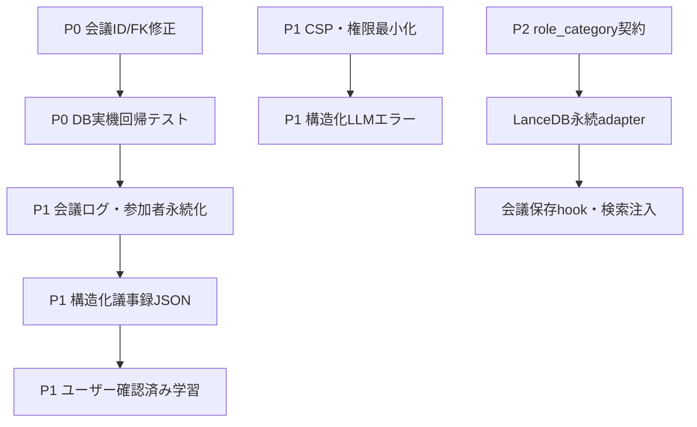

# Holistic Review Action Register — 2026-08-11

レビュー結果を実装タスクへ落とし込むための進捗管理表。優先度は `docs/code_review_report_20260811.md` と同じく、P0（実行時データ損失）を最上位とする。

## ステータス定義

- **完了**: 実装・検証・関連資料の更新まで完了
- **進行中**: 実装または設計判断に着手済み
- **未着手**: 設計・実装のいずれも未完了
- **保留**: ユーザー判断または外部選定が必要

## アクション一覧

| 優先度 | タスク | 状態 | 完了条件 / 次の一手 | 関連箇所 |
|---|---|---|---|---|
| P0 | 会議開始時に `meetings` 行を作成し、実IDを利用量ログへ渡す | **完了（2026-08-11）** | `meeting_id=999` を廃止。会議ID確定後に発言ループを開始。ビルド・26テスト成功。DB実機回帰テストを追加する | `MeetingScreen.tsx`, `SQLITE_MIGRATION_V3.md` |
| P1 | 会議発言・参加者を `meeting_messages` / `meeting_participants` へ保存 | 未着手 | サマリー保存と同一トランザクションで通常発言・割り込み・参加者を永続化 | `DESIGN_SPEC.md` §6.3, `DATA_SCHEMA.md` §2 |
| P1 | S7割り込み状態機械（10秒強調・連鎖上限3） | 未着手 | 発言中→割り込み受付中→一時停止中を実装し、`interrupt_chain_count` を保存・検証 | `DESIGN_SPEC.md` §6.3, `DATA_SCHEMA.md` §2.3 |
| P1 | ユーザー確認済み決定事項だけを学習化 | **進行中** | AI生成の自動学習経路は停止済み。S8で決定事項を入力・確認し、保存時だけ `member_learnings` へ登録するUI/経路を追加 | `DESIGN_SPEC.md` 原則3/4, §6.3 |
| P1 | 議事録の構造化JSON契約を実装 | 未着手 | `issues/pro_con_table/facts/decisions/next_actions` をJSONとして検証・保存。空欄は空配列で保持 | `DATA_SCHEMA.md` §3.1 |
| P1 | Tauri CSP・SQL/fs権限を最小化 | 未着手 | `csp: null` を廃止し、接続先を許可リスト化。再帰書込みと無制限SQL権限を削減 | `DESIGN_SPEC.md` §8, `tauri.conf.json`, `capabilities/default.json` |
| P1 | LLM結果を成功・失敗の構造化型へ分離 | 未着手 | エラー文字列をチャット/会議ログへ保存しない。モデル判定・フォールバック判定を一元化 | `llmProvider.ts`, `ChatScreen.tsx`, `MeetingScreen.tsx` |
| P1 | デザインSSoTトークン・フォント・ボタンを統一 | 未着手 | `DESIGN_SYSTEM.md` のCSS変数・2フォント・共通ボタンを全画面で使用 | `DESIGN_SYSTEM.md`, `index.css`, `src/components/` |
| P2 | `member_learnings` の取得を最新N件に制限 | 未着手 | `created_at DESC LIMIT 5` を4層マージとRAGフォールバックで共通化 | `promptMerger.ts`, `PHASE2_PLAN.md` §2.6 |
| P2 | RAG `role_category` フィルタ契約を追加 | 未着手 | `VectorSearchOptions` と永続adapterに役割フィルタを追加 | `RAG_FOUNDATION.md`, `PHASE2_PLAN.md` §2.5 |
| P2 | Rustマイグレーション・FK回帰テスト | 未着手 | V1→V3、孤立FKロールバック、`foreign_key_check` を自動化 | `src-tauri/src/`, `SQLITE_MIGRATION_V3.md` |
| P2 | App/画面Propsの `any` と巨大コンポーネントを整理 | 未着手 | DB行型・画面型を定義し、初期化/キー/ルーティングを深いモジュールへ分割 | `App.tsx`, `src/components/` |
| P2 | S4/S5/Settingsの未実装導線を補完 | 未着手 | メンバー追加、会議モード遷移、成長日誌CRUD、設定永続化を実装 | `DESIGN_SPEC.md` §6.3 |

## 依存関係

## 更新履歴

| 日付 | 内容 |
|---|---|
| 2026-08-11 | Holistic reviewのP0〜P2所見をタスク化。P0の会議ID/FK修正を完了として記録。 |
