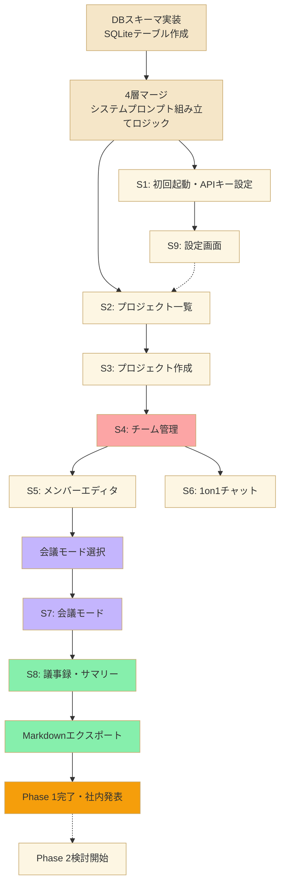

# ROADMAP.md
## AI Team Builder（AIカンパニー）Phase1 実装ロードマップ
Version 1.0 / 依存関係ベース（時間ベースではない）

---

## 0. 設計方針

- 本ロードマップは**時間見積もりではなく、依存関係（前工程が終わらないと次に進めない）で構成する**。
- 各ノードの完了自体が一つのチェックポイントであり、曜日・時間で区切らない。
- Phase 2（RAG、LangChain.js本格導入、コアプロフィール作り込み等）はPhase1完了後に着手する。今は範囲外。

---

## 1. 全体フロー（Mermaid）

---

## 2. ノードの意味と完了条件

| ノード | 内容 | 完了条件 |
|---|---|---|
| A | DBスキーマ実装 | DATA_SCHEMA.mdの全11テーブルがSQLiteに作成され、マイグレーションが動作する |
| B | 4層マージロジック | users→projects→departments→membersの4値を結合し、1つのsystem_promptとして出力できる関数が動作する |
| C1 | S1 初回起動・APIキー設定 | OpenAI/Anthropic/GeminiのいずれかのAPIキーを入力し、Tauri secure storageに保存できる |
| C9 | S9 設定画面 | APIキー管理＋コアプロフィール入力欄が機能する |
| D2 | S2 プロジェクト一覧 | 複数プロジェクトの作成・一覧表示・選択ができる |
| D3 | S3 プロジェクト作成 | 部署プリセットを選択し、プロジェクトの目的・価値観を入力できる |
| D4 | S4 チーム管理 | 部署タブが表示され、部署ごとのメンバー一覧・人格継承バッジが見える |
| E5 | S5 メンバーエディタ | 継承元パネル（プロジェクト・部署の性質）を確認しながら個人人格プロンプトを編集できる |
| E6 | S6 1on1チャット | 特定メンバーと個別に会話でき、ログがchat_messagesに保存される |
| F7A | 会議モード選択 | 会議開始時に「探索」「収束」のどちらかを選ぶモーダルが機能する |
| F7 | S7 会議モード | ラウンドロビンで発言が進行し、10秒割り込みウィンドウ・最大3回連鎖制限・一時停止ボタンが動作する |
| G8 | S8 議事録・サマリー | モードに応じたテンプレートで議事録が生成され、decisions欄が空のまま表示される |
| H | Markdownエクスポート | 議事録をMarkdownファイルとしてローカルに出力できる |
| I | Phase1完了・社内発表 | 上記全てが一連の流れとして動作し、実際に1つのプロジェクトで会議から議事録出力までを通しで実行できる |
| J | Phase2検討開始 | Phase1の実体験を踏まえ、RAG・LangChain.js等の詳細設計に着手する（本ロードマップの範囲外） |

---

## 3. 実装時の注意（AI_RULES.mdとの連携）

- 各ノードの実装が完了するごとに、`/docs/design`配下の関連ドキュメント（DESIGN_SPEC.md / DATA_SCHEMA.md）と実装内容に差分がないか確認する。
- ノードBは特に重要。ここで4層マージのロジックが崩れると、D以降の全画面に影響するため、UIより先に単体で動作確認すること。
- 依存関係の矢印（→）は「前工程が完了しないと着手できない」ことを意味する。点線（-.->）は緩やかな前提関係であり、厳密なブロッキングではない。
